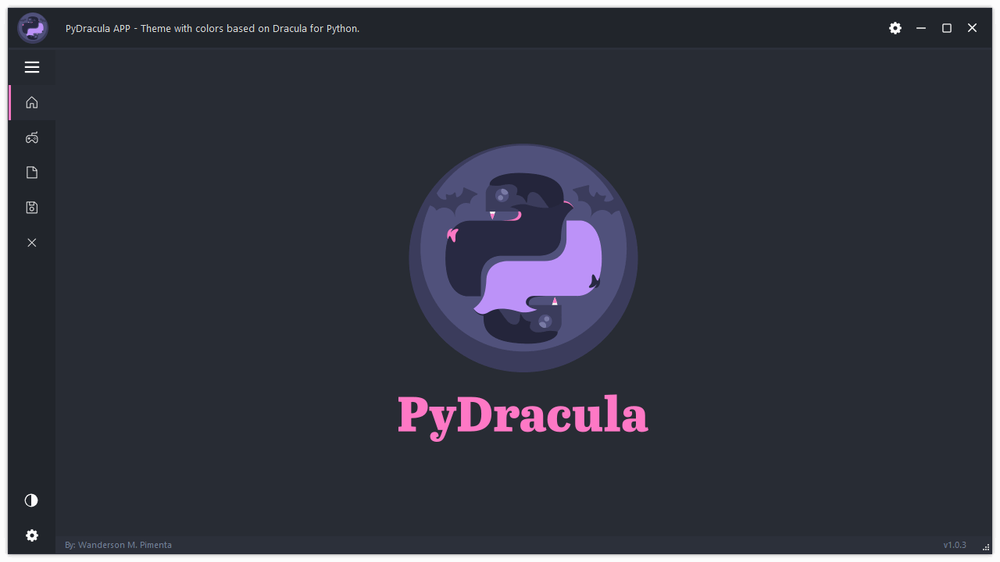
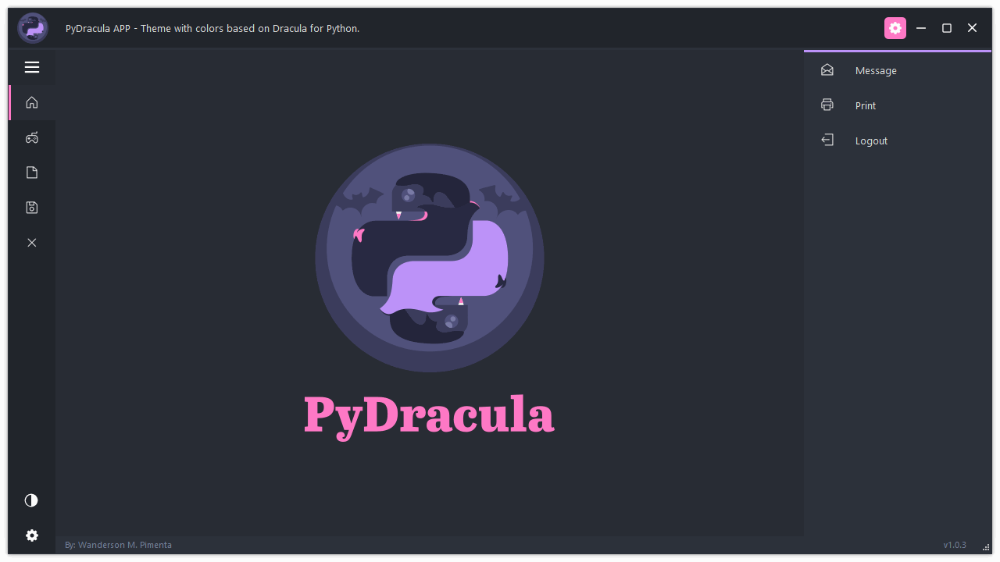

<div align="center" height="256" width="256">
    <h1>PinnacleQt_GUI_PySide6_PyQt6</h1>
<br>


</div>

<br>

<p>🔥本项目旨在为 <b>Python GUI</b> 开发提供一个更加强大和灵活的解决方案，使得开发工作变得更加高效和灵活。。本框架适用于构建各种客户端应用程序，无论是数据库管理工具、图形化数据分析界面还是个性化的业务应用。</p>

<hr>


## ✨项目简介

本项目是一个基于 `PySide6` 的现代 `GUI` 应用，采取了 MVC 架构，设计上对程序进行了解耦，使得整个项目结构更加清晰，易于理解和维护。
- [x] 使用 MVC 架构重构项目，提升代码的可维护性和可读性。
- [x] 项目结构清晰，便于新功能的快速集成和现有功能的扩展。
- [x] 抽象化常用功能，提高开发效率和代码复用率。

## 动图展示
<details>
<summary><b>展开</b></summary>

### 启动界面


### 基本展示



### 切换主题



</details>


## 🧐特性

以下是具体的特性说明：

- **采用 MVC 架构**：通过模型（Model）、视图（View）和控制器（Controller）的分离，实现了逻辑与界面的解耦，为项目的后续维护和扩展打下了坚实基础。
- **易于扩展**：MVC架构设计让添加新功能变得更加容易和直接，无需修改大量现有代码即可实现功能的扩展。
- **功能抽象化**：将项目中的常用功能和组件抽象成独立的模块和函数，提高了代码的复用性，同时也简化了功能的修改和升级过程。


## 📖项目结构

<details>
<summary><b>展开</b></summary>

```md
PinnacleQt_GUI_PySide6_PyQt6/
├── <assets>             # 展示图片
├── config/              # 应用配置相关文件
│   ├── __init__.py
│   └── config.py        # 应用的全局配置设置
├── controllers/         # MVC 中的控制器组件
│   ├── __init__.py
│   └── controller_main.py  # 主要的应用逻辑控制器
├── models/              # MVC 中的模型组件，处理数据逻辑
│   └── __init__.py
├── tests/               # 单元测试和功能测试文件
│   ├── __init__.py
│   └── demo.py          # 示例测试文件
├── views/               # MVC 中的视图组件，用户界面文件
│   ├── resources/       # UI 资源，如图标、图片等
│   │   ├── icons/
│   │   ├── images/
│   │   ├── svgs/
│   │   ├── themes/      # UI 主题文件
│   │   │   ├── py_dracula_dark.qss
│   │   │   └── py_dracula_light.qss
│   │   ├── ui_files/    # Qt Designer UI 文件
│   │   │   └── main.ui
│   │   └── resources.qrc
│   ├── ui_components/   # 重用的UI组件和逻辑
│   │   ├── __init__.py
│   │   ├── animations.py  # 动画效果实现
│   │   └── ui_setup.py    # UI设置和初始化
│   ├── ui_designs/      # UI 设计文件，基于PySide6自动生成的Python文件
│   │   ├── __init__.py
│   │   ├── resources_rc.py
│   │   ├── ui_login.py    # 登录界面UI设计
│   │   └── ui_main.py     # 主界面UI设计
│   ├── widgets/         # 自定义的Qt Widgets
│   │   ├── __init__.py
│   │   ├── custom_grips.py  # 自定义窗口调整大小控件
│   │   ├── login_window.py  # 登录窗口实现
│   │   └── main_window.py   # 主窗口实现
│   ├── __init__.py
│   └── view_main.py     # 主视图管理器，负责整合和管理应用的所有视图
└── main.py              # 应用程序的入口文件

```
</details>

## ✅开发

> 本项目使用 `Python` 和 `PySide6`，确保你已经安装了 `Python 3.12+` 和 `PySide6`


### 如何启动

1. 克隆仓库到本地：
   ```bash
   git clone https://github.com/Frica01/PinnacleQt_GUI_PySide6_PyQt6.git
   ```

   

2. 安装所需依赖：

   ```bash
   pip install -r requirements.txt
   ```

   

3. 启动应用：

   ```bash
   python main.py
   ```


### 扩展使用

想要对本项目进行定制化使用，您可以按照以下步骤操作： 

1. **模型（Model）定制**：在 `models/` 目录下添加自己的逻辑处理文件。这些文件应该包含处理应用数据、与数据库交互等逻辑。
2. **视图（View）定制**：在 `views/` 目录下添加或修改界面文件。根据您的需求设计用户界面，并通过 Qt Designer 或代码来实现它们。
3. **控制器（Controller）使用**：在 `controllers/` 目录下创建或修改文件，将模型和视图连接起来。控制器负责响应用户输入，通过模型获取数据，然后更新视图显示。 

通过上述步骤，您可以轻松扩展现有的功能或为应用添加全新的特性。

## ✉️ 联系作者
如果您有任何问题或者想要更多地了解项目，欢迎通过以下方式联系我：
- 微信公众号：小菜的Python杂货铺 [扫码关注公众号](./assets/WeChat_Official_Account.jpg)
- QQ群聊：[扫码加入群聊](./assets/QQ_group.png)
- 在GitHub上 [提交Issue](https://github.com/Frica01/PinnacleQt_GUI_PySide6_PyQt6/issues)


## 致谢

本项目的灵感来源于 [Wanderson-Magalhaes](https://github.com/Wanderson-Magalhaes) 的创意和贡献。我对他在开源社区的工作表示由衷的敬意和感谢。
本项目基于以下两个项目的重构版本。

- [Modern_GUI_PyDracula_PySide6_or_PyQt6](https://github.com/Wanderson-Magalhaes/Modern_GUI_PyDracula_PySide6_or_PyQt6)
- [PyBlackBox_Qt_Widgets_PySide6_Or_PyQt6_v1.0.0](https://github.com/Wanderson-Magalhaes/PyBlackBox_Qt_Widgets_PySide6_Or_PyQt6_v1.0.0)


## 许可证

该项目在 MIT 许可证下开源。更多详情请查阅 GitHub 仓库中 [LICENSE](LICENSE) 文件。

